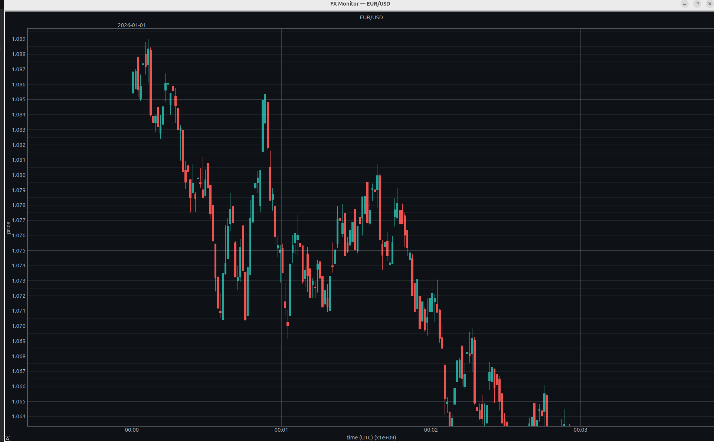

# FXTrading

Real-time FX candlestick charting with a local SQLite cache. Streams live
prices from Interactive Brokers (via `ib_insync`) or a built-in random-walk
simulator, stores 1-second OHLC bars, and renders scrolling candlestick charts
with a UTC datetime x-axis.




## Features

- **Live candlestick charts** for EUR/USD, GBP/USD, USD/TRY, USD/CAD
- **Pop-out windows:** click any subplot to open it in a dedicated window with
  full zoom/drag/scroll interaction
- **Zoom-driven candlestick width** in the pop-out: bar interval adapts to the
  visible time span (1s for windows <= 100s; otherwise the widest admissible
  width that keeps at least 30 candles — 1s, 10s, 20s, 30s, 1m, 5m, 10m, 1h, 1d)
- **Centred candles:** each candle is drawn at the midpoint of its time period
- **Two-tier x-axis** in the pop-out: bottom axis ticks aligned to bar
  boundaries, top axis divides days
- **Candlestick-width readout** in the top-right of the pop-out
- **SQLite cache with WAL mode:** the viewer reads from a local file, so
  restarting it never re-requests data from IBKR
- **Writer lock:** prevents two backend processes from corrupting the DB
  simultaneously

## Quick start

### Simulated data (no TWS needed)

```bash
uv run python src/fx_monitor.py --simulate
```

This launches the random-walk sim and the viewer in one process. The sim
resumes from the last stored bar on restart, so simulated time is contiguous
across stop/start cycles. To start fresh:

```bash
uv run python src/fx_monitor.py --simulate --reset
```

### Live IBKR data

Run the backend and viewer as separate processes:

```bash
uv run python src/ingest.py --port 7497      # backend (TWS/IBG on port 7497)
uv run python src/fx_monitor.py --db fxreal.db # viewer (can run multiple)
```

## Architecture

```
src/ingest.py      IBKR ingestion backend (or --simulate random walk)
src/sim.py         Random-walk simulation engine
src/fx_monitor.py  PySide6/pyqtgraph candlestick viewer
src/store.py       SQLite-backed tick/bar store (WAL mode)
src/pairs.py       FX pair definitions
```

The backend writes 1-second bars to the SQLite cache; the viewer reads and
aggregates them on the fly to any whole-second interval. WAL mode lets the
single writer and concurrent readers operate on separate connections without
blocking each other.

## Options

### `fx_monitor.py`

| Flag | Default | Description |
|------|---------|-------------|
| `--db` | `fxsim.db` / `fxreal.db` | SQLite database path |
| `--bar-seconds` | `5` | Displayed OHLC bar interval (seconds) |
| `--window` | `80` | Number of visible bars |
| `--refresh-ms` | `100` | GUI refresh interval (ms) |
| `--pairs` | all four | Comma list, e.g. `EUR/USD,GBP/USD` |
| `--simulate` | off | Launch the sim in-process |
| `--reset` | off | Wipe the sim DB and reset the clock |
| `--quit-after` | `0` | Auto-quit after N seconds (testing) |

### `ingest.py`

| Flag | Default | Description |
|------|---------|-------------|
| `--port` | `7497` | TWS/IBG socket port (7497 paper / 7496 live) |
| `--host` | `127.0.0.1` | TWS/IBG host |
| `--client-id` | `1` | IBKR client ID |
| `--pairs` | all four | Comma list, e.g. `EUR/USD,GBP/USD` |
| `--db` | `fxsim.db` / `fxreal.db` | SQLite database path |
| `--flush-ms` | `200` | DB batch-write interval (ms) |
| `--tick-retention-days` | `7` | Delete raw ticks older than N days |
| `--simulate` | off | Random-walk source instead of IBKR |
| `--reset` | off | Wipe the sim DB |